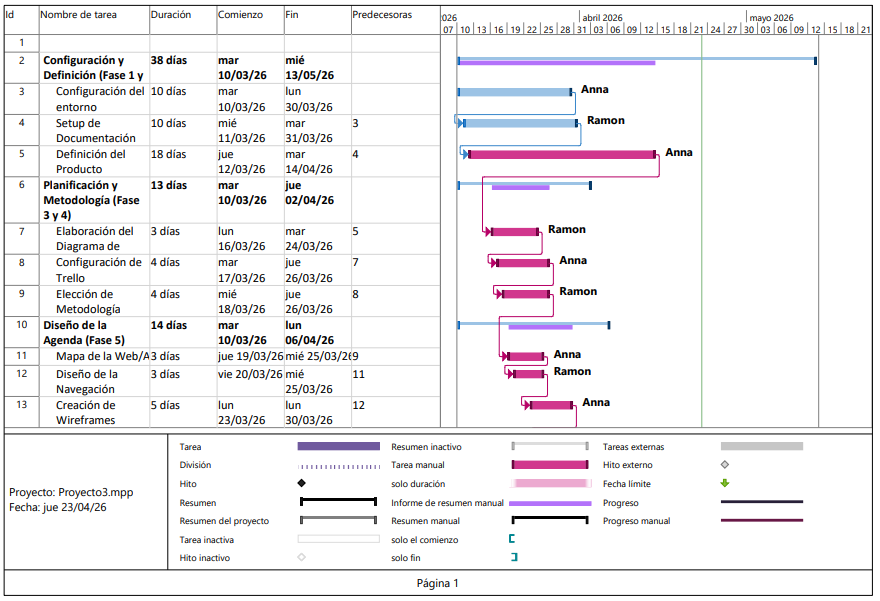
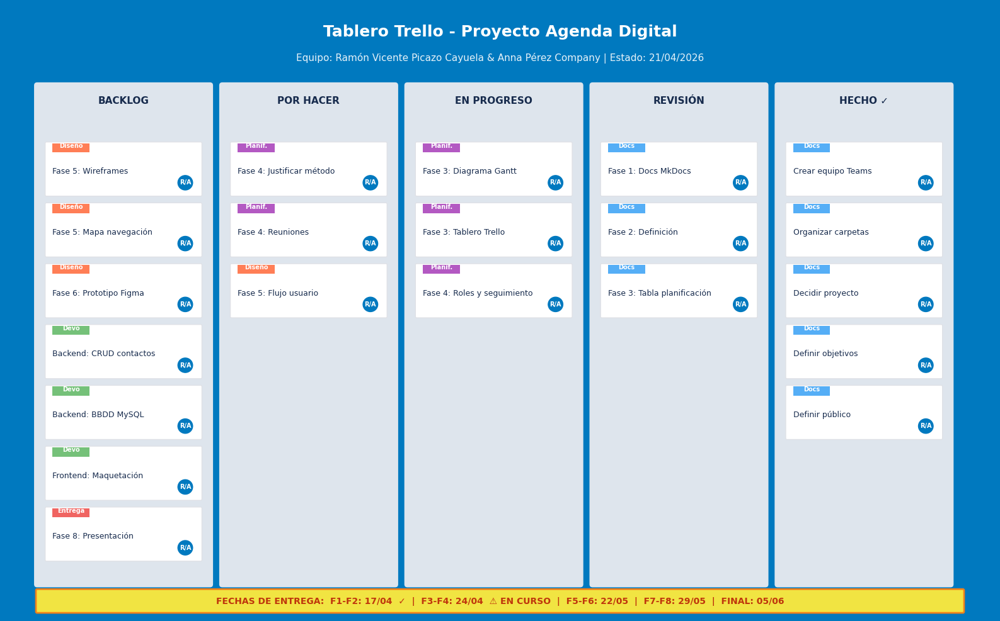

# Fase 3: Planificación del Proyecto

## 📌 Resumen de la Fase

En esta fase se organiza el trabajo temporal del proyecto mediante un **diagrama de Gantt** que establece las fases, duraciones y dependencias, y un **tablero Trello** para la gestión ágil de tareas, asignación de responsables y seguimiento diario del progreso.

!!! success "Estado"
    **En progreso** (entrega: 24/04/2026)

---

## 1. 📅 Calendario Académico de Entregas

| Bloque de Fases | Fecha de Apertura | Fecha de Vencimiento | Estado |
|-----------------|-------------------|----------------------|--------|
| **Fase 1 – Fase 2** | 10/03/2026 | **17/04/2026** | ✅ Entregado |
| **Fase 3 – Fase 4** | 10/03/2026 | **24/04/2026** | 🔄 En curso |
| **Fase 5 – Fase 6** | 10/03/2026 | **22/05/2026** | ⏳ Pendiente |
| **Fase 7 – Fase 8** | 10/03/2026 | **29/05/2026** | ⏳ Pendiente |
| **Entrega Final** | 10/03/2026 | **05/06/2026** | ⏳ Pendiente |

---

## 2. 📊 Diagrama de Gantt

El diagrama de Gantt representa la planificación temporal completa del proyecto, ajustada a las fechas reales de entrega del aula.

### Tabla de Planificación

| Fase / Tarea | Fecha Inicio | Fecha Fin | Duración | Responsable | Bloque de Entrega |
|-------------|--------------|-----------|----------|-------------|-------------------|
| **Fase 1: Equipo y Entorno** | 10/03/2026 | 30/03/2026 | 20 días | Ambos | F1-F2 (17/04) |
| **Fase 2: Definición del Proyecto** | 20/03/2026 | 06/04/2026 | 18 días | Ambos | F1-F2 (17/04) |
| **Fase 3: Planificación** | 10/04/2026 | 16/04/2026 | 7 días | Ambos | **F3-F4 (24/04)** |
| **Fase 4: Metodología** | 18/04/2026 | 23/04/2026 | 6 días | Ambos | **F3-F4 (24/04)** |
| **Fase 5: Diseño Web** | 25/04/2026 | 08/05/2026 | 14 días | Ambos | F5-F6 (22/05) |
| **Fase 6: Prototipo Visual** | 09/05/2026 | 16/05/2026 | 8 días | Anna | F5-F6 (22/05) |
| **Desarrollo Backend (PHP)** | 25/04/2026 | 22/05/2026 | 28 días | Ramón | F5-F6 (22/05) |
| **Desarrollo Frontend** | 02/05/2026 | 22/05/2026 | 21 días | Anna | F5-F6 (22/05) |
| **Pruebas y Depuración** | 16/05/2026 | 27/05/2026 | 12 días | Ambos | F7-F8 (29/05) |
| **Fase 7: Documentación Final** | 23/05/2026 | 27/05/2026 | 5 días | Ambos | F7-F8 (29/05) |
| **Fase 8: Presentación** | 26/05/2026 | 29/05/2026 | 4 días | Ambos | F7-F8 (29/05) |
| **Entrega Final y Revisión** | 30/05/2026 | 05/06/2026 | 6 días | Ambos | **Final (05/06)** |

!!! info "Tareas paralelas"
    El desarrollo backend y frontend se ejecutan en paralelo con las fases de diseño para optimizar el tiempo disponible hasta el 22 de mayo.

### Hitos Importantes

| Hito | Fecha | Descripción |
|------|-------|-------------|
| **Kick‑off** | 10/03/2026 | Apertura oficial del proyecto en el aula |
| **Entrega F1-F2** | 17/04/2026 | Cierre de fases organizativas y de definición |
| **Entrega F3-F4** | 24/04/2026 | Planificación y metodología documentadas |
| **Entrega F5-F6** | 22/05/2026 | Diseño, prototipo y desarrollo funcional |
| **Entrega F7-F8** | 29/05/2026 | Documentación final y presentación |
| **Entrega Final** | 05/06/2026 | Proyecto completo y cerrado |

---

## 3. 🗂️ Tablero Trello

Se utiliza Trello como herramienta de gestión visual del trabajo. El tablero sigue una estructura Kanban con cinco listas principales.

### Estructura del Tablero

| Lista | Propósito |
|-------|-----------|
| **Backlog** | Tareas futuras pendientes de priorizar |
| **Por Hacer** | Tareas del sprint actual no iniciadas |
| **En Progreso** | Tareas que se están ejecutando actualmente |
| **Revisión** | Tareas terminadas a la espera de validación |
| **Hecho ✓** | Tareas completadas y verificadas |

### Etiquetas de Categorización

| Color | Categoría | Uso |
|-------|-----------|-----|
| 🟣 Morado | Planificación | Tareas de organización temporal y metodología |
| 🟠 Naranja | Diseño | Wireframes, navegación y prototipado |
| 🔵 Azul | Documentación | MkDocs, memoria y anexos |
| 🟢 Verde | Desarrollo | Código PHP, HTML/CSS y JavaScript |
| 🔴 Rojo | Entrega | Presentación y despliegue final |

### Tareas Detalladas por Fase

#### Fase 3 — Planificación (entrega 24/04)

| Tarea | Responsable | Estado | Prioridad |
|-------|-------------|--------|-----------|
| Crear diagrama de Gantt con fechas reales | Ramón | En progreso | Alta |
| Configurar tablero Trello con etiquetas | Anna | En progreso | Alta |
| Estimar duraciones de tareas | Ambos | En progreso | Alta |
| Definir dependencias entre fases | Ambos | Por hacer | Media |
| Documentar tabla de planificación | Ambos | Revisión | Media |

#### Fase 4 — Metodología (entrega 24/04)

| Tarea | Responsable | Estado | Prioridad |
|-------|-------------|--------|-----------|
| Elegir y justificar metodología de trabajo | Ambos | Por hacer | Alta |
| Definir horarios de reuniones | Ambos | Por hacer | Media |
| Establecer flujo de seguimiento (Trello + Git) | Ambos | En progreso | Alta |
| Asignar roles y responsabilidades | Ambos | En progreso | Media |

#### Fase 5 — Diseño Web (entrega 22/05)

| Tarea | Responsable | Estado | Prioridad |
|-------|-------------|--------|-----------|
| Crear mapa de páginas | Anna | Backlog | Alta |
| Definir estructura de navegación | Ramón | Backlog | Alta |
| Wireframe página de login | Anna | Backlog | Media |
| Wireframe página de inicio | Ramón | Backlog | Media |
| Wireframe formulario de contacto | Anna | Backlog | Media |
| Definir flujo de usuario | Ambos | Por hacer | Alta |

#### Fase 6 — Prototipo Visual (entrega 22/05)

| Tarea | Responsable | Estado | Prioridad |
|-------|-------------|--------|-----------|
| Diseño en Figma (alta fidelidad) | Anna | Backlog | Alta |
| Revisión de consistencia visual | Ramón | Backlog | Media |

#### Desarrollo (entrega 22/05)

| Tarea | Responsable | Estado | Prioridad |
|-------|-------------|--------|-----------|
| Configurar entorno PHP y MySQL | Ramón | Backlog | Alta |
| Crear estructura MVC | Ramón | Backlog | Alta |
| Diseñar base de datos (contactos) | Ramón | Backlog | Alta |
| Implementar CRUD de contactos | Ramón | Backlog | Alta |
| Maquetación HTML/CSS responsive | Anna | Backlog | Alta |
| Programar validaciones JavaScript | Anna | Backlog | Media |
| Implementar búsqueda y filtros | Anna | Backlog | Media |

### Enlace al Tablero

| Recurso | Enlace | Acceso |
|---------|--------|--------|
| **Tablero Trello** | [https://trello.com/b/proyecto-agenda-dam](https://trello.com/b/proyecto-agenda-dam) | 👥 Privado (equipo) |

---

## 4. 📅 Organización Temporal

### Calendario Semanal Tipo

| Día | Actividad Principal | Duración |
|-----|---------------------|----------|
| **Lunes** | Sprint Planning + Revisión de objetivos semanales | 30 min |
| **Martes - Jueves** | Trabajo autónomo y desarrollo de tareas asignadas | 2-3 h/día |
| **Viernes** | Sprint Review + Actualización de Trello y documentación | 45 min |

### Gestión de Dependencias

!!! warning "Tareas críticas"
    Las fases de diseño (5 y 6) son **bloqueantes** para el desarrollo frontend. El backend puede iniciarse en paralelo una vez definida la arquitectura de la base de datos en la Fase 4.

### Control de Riesgos

| Riesgo | Probabilidad | Impacto | Mitigación |
|--------|--------------|---------|------------|
| Retraso en el diseño | Media | Alto | Adelantar wireframes de baja fidelidad |
| Problemas de conectividad BBDD | Baja | Alto | Pruebas locales con XAMPP desde el inicio |
| Falta de tiempo por exámenes | Alta | Medio | Buffer de 3 días antes de cada entrega |
| Incompatibilidad de horarios | Media | Medio | Comunicación asíncrona por Teams |

---

## 5. 📋 Checklist de la Fase

- [x] Definir todas las tareas del proyecto
- [x] Estimar duraciones realistas
- [x] Crear diagrama de Gantt con fechas reales
- [x] Configurar tablero Trello con etiquetas
- [x] Asignar responsables a cada tarea
- [ ] Validar planificación con el tutor *(pendiente)*
- [ ] Ajustar fechas según feedback

---

!!! tip "Navegación"
    ← [Fase 2: Definición ](fase2.md) | [Fase 4: Metodología ](fase4.md) →