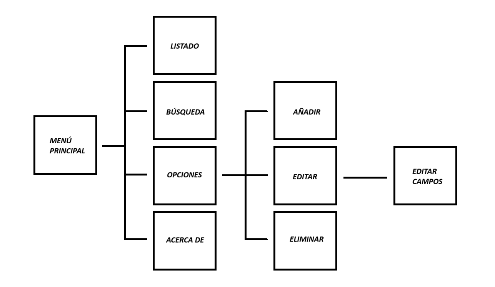
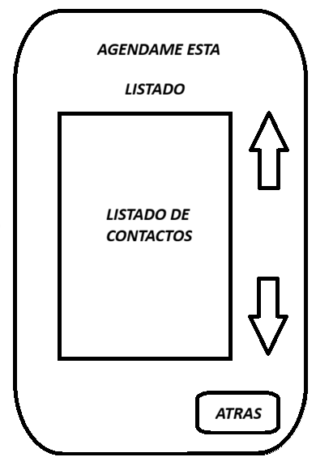
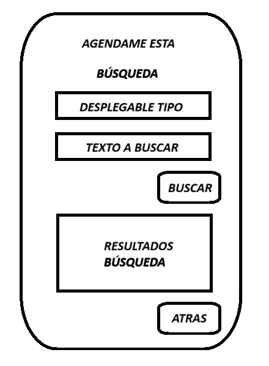
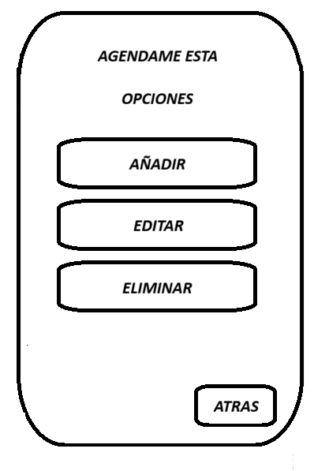
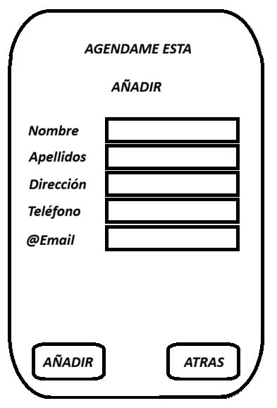
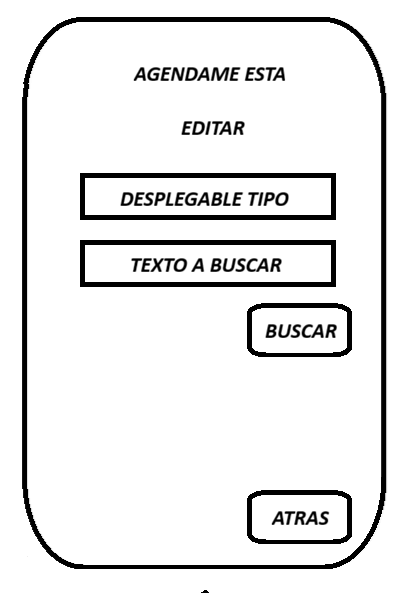
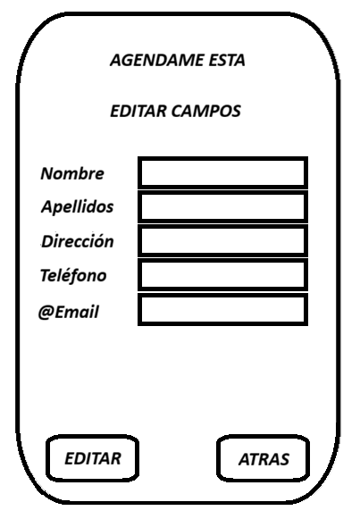
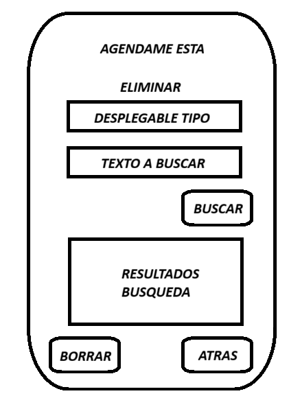
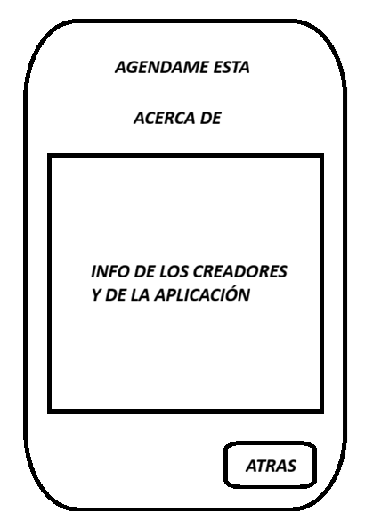
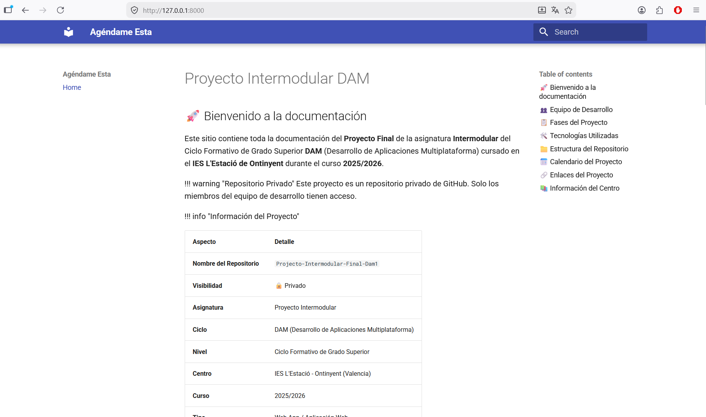

# Fase 7: Documentación del Proyecto

## 📌 Resumen de la Fase

En esta fase se recopila, sintetiza y finaliza toda la documentación técnica y de proceso del proyecto **"Agéndame Esta"**. El objetivo es preparar en un único sitio MkDocs toda la información generada durante las fases anteriores, añadiendo la evolución del trabajo y las decisiones técnicas tomadas, para que el proyecto sea comprensible.


---

## 1. 📖 Descripción del Proyecto

### 1.1 ¿Qué es "Agéndame Esta"?

**"Agéndame Esta"** es una aplicación web de gestión de contactos —una agenda digital— desarrollada como proyecto final de la asignatura **Intermodular** del Ciclo DAM en el **IES L'Estació de Ontinyent**.

La aplicación permite almacenar, organizar, consultar, editar y eliminar información personal y profesional de contactos desde una interfaz web accesible desde cualquier dispositivo.

### 1.2 Objetivos

| Objetivo | Descripción |
|----------|-------------|
| **Funcional** | Crear una agenda digital moderna con operaciones CRUD completas sobre contactos. |
| **Técnico** | Aplicar conocimientos de PHP, HTML/CSS y JavaScript en un proyecto integrado. |
| **Metodológico** | Simular el desarrollo de un producto real con planificación, diseño y documentación profesional. |
| **Formativo** | Trabajar en equipo aplicando control de versiones, metodologías ágiles y documentación técnica. |

### 1.3 Público Objetivo

- Usuarios particulares que desean organizar sus contactos personales  
- Estudiantes que gestionan contactos académicos o profesionales  
- Pequeños negocios que necesitan una agenda simple sin sistemas complejos  

### 1.4 Problema que Resuelve

Centraliza la información de contactos que normalmente se encuentra dispersa entre móviles, libretas físicas, correos y otras aplicaciones, evitando duplicidades, pérdidas de datos y dificultades de búsqueda.

---

## 2. 📅 Planificación

### 2.1 Calendario de entregas

| Bloque de Fases | Fecha de Apertura | Fecha de Vencimiento | Estado |
|-----------------|-------------------|----------------------|--------|
| **Fase 1 – Fase 2** | 10/03/2026 | 17/04/2026 | ✅ Entregado |
| **Fase 3 – Fase 4** | 10/03/2026 | 24/04/2026 | ✅ Entregado |
| **Fase 5 – Fase 6** | 10/03/2026 | 22/05/2026 | ✅ Entregado |
| **Fase 7 – Fase 8** | 10/03/2026 | 29/05/2026 | ✅ Entregado |
| **Entrega Final** | 10/03/2026 | 05/06/2026 | ⏳ Entrega pendiente |

### 2.2 Diagrama de Gantt

El diagrama de Gantt recoge la planificación temporal completa del proyecto, incluyendo las fases de diseño, desarrollo, pruebas y documentación.


### 2.3 Tabla de Planificación Final

| Fase / Tarea | Fecha Inicio | Fecha Fin | Duración | Responsable |
|--------------|--------------|-----------|----------|-------------|
| **Fase 1: Equipo y Entorno** | 10/03/2026 | 30/03/2026 | 20 días | Ambos |
| **Fase 2: Definición del Proyecto** | 20/03/2026 | 06/04/2026 | 18 días | Ambos |
| **Fase 3: Planificación** | 10/04/2026 | 16/04/2026 | 7 días | Ambos |
| **Fase 4: Metodología** | 18/04/2026 | 23/04/2026 | 6 días | Ambos |
| **Fase 5: Diseño Web** | 25/04/2026 | 08/05/2026 | 14 días | Ambos |
| **Fase 6: Prototipo Visual** | 09/05/2026 | 16/05/2026 | 8 días | Anna |
| **Desarrollo Backend (PHP)** | 25/04/2026 | 22/05/2026 | 28 días | Ramón |
| **Desarrollo Frontend** | 02/05/2026 | 22/05/2026 | 21 días | Anna |
| **Pruebas y Depuración** | 16/05/2026 | 27/05/2026 | 12 días | Ambos |
| **Fase 7: Documentación Final** | 23/05/2026 | 27/05/2026 | 5 días | Ambos |
| **Fase 8: Presentación** | 26/05/2026 | 29/05/2026 | 4 días | Ambos |
| **Entrega Final y Revisión** | 30/05/2026 | 05/06/2026 | 6 días | Ambos |

### 2.4 Tablero Trello

Se utilizó Trello como herramienta de gestión visual del trabajo con estructura Kanban.


| Lista | Propósito |
|-------|-----------|
| **Backlog** | Tareas futuras pendientes de priorizar. |
| **Por Hacer** | Tareas del sprint actual no iniciadas. |
| **En Progreso** | Tareas que se están ejecutando actualmente. |
| **Revisión** | Tareas terminadas a la espera de validación. |
| **Hecho ✓** | Tareas completadas y verificadas. |

---

## 3. 🔄 Metodología de Trabajo

### 3.1 Modelo Mixto: Kanban + Scrum

Dado que el equipo está formado por dos personas, se adoptó un enfoque híbrido que combina la visualización de Kanban con la planificación por iteraciones de Scrum.

| Metodología | Elementos Utilizados | Propósito |
|-------------|----------------------|-----------|
| **Kanban** | Tablero visual, flujo continuo, límites WIP. | Visualizar el estado de cada tarea y evitar cuellos de botella. |
| **Scrum** | Sprints de 1 semana, dailies, reviews, retrospectivas. | Entregar valor de forma iterativa y mantener ritmo constante. |

### 3.2 Reuniones del Equipo

| Reunión | Frecuencia | Duración | Objetivo |
|---------|------------|----------|----------|
| **Daily Standup** | De lunes a viernes | 10–15 min | Sincronizar trabajo diario y detectar bloqueos. |
| **Sprint Planning** | Lunes de cada semana | 30 min | Seleccionar tareas del backlog para el sprint. |
| **Sprint Review** | Viernes de cada semana | 20 min | Demostrar lo hecho y validar criterios de aceptación. |
| **Retrospectiva** | Viernes de cada semana | 15 min | Analizar qué funcionó, qué no, y establecer mejoras. |

### 3.3 Flujo de Trabajo en GitHub

| Convención | Descripción |
|------------|-------------|
| **Ramas** | `main` (producción), `develop` (integración), `feature/nombre-tarea` (desarrollo). |
| **Commits** | Mensajes descriptivos en español: `feat:`, `fix:`, `docs:` |
| **Pull Requests** | Cada funcionalidad nueva se integra mediante PR revisada por el compañero. |
| **Issues** | Bugs y mejoras registrados como Issues vinculados al proyecto. |

---

## 4. 🗺️ Diseño de la Web

### 4.1 Mapa de Páginas

La aplicación consta de 9 pantallas principales organizadas jerárquicamente desde un menú central.


| # | Pantalla | Descripción |
|---|----------|-------------|
| 1 | **Menú Principal** | Punto de entrada con acceso a todas las secciones. |
| 2 | **Listado** | Visualización de todos los contactos. |
| 3 | **Búsqueda** | Filtrado y búsqueda de contactos por criterios. |
| 4 | **Opciones** | Submenú de gestión: Añadir, Editar, Eliminar. |
| 5 | **Añadir** | Formulario para crear un nuevo contacto. |
| 6 | **Editar** | Búsqueda del contacto a modificar. |
| 7 | **Editar Campos** | Formulario con los datos del contacto seleccionado. |
| 8 | **Eliminar** | Búsqueda y confirmación de borrado. |
| 9 | **Acerca de** | Información de los creadores y la aplicación. |

### 4.2 Estructura de Navegación

La navegación sigue un modelo jerárquico en árbol con retorno al menú principal. Todas las pantallas secundarias disponen de un botón **"ATRÁS"**.



### 4.3 Wireframes de Baja Fidelidad

Los wireframes definen la disposición de elementos en cada pantalla priorizando la usabilidad.

| Pantalla | Imagen |
|----------|--------|
| Menú Principal |  |
| Listado |  |
| Búsqueda |  |
| Opciones |  |
| Añadir |  |
| Editar |  |
| Editar Campos |  |
| Eliminar |  |
| Acerca De |  |

---

## 5. 🎨 Prototipo Visual

### 5.1 Herramienta Utilizada

Se eligió **Canva** como herramienta de prototipado visual por su facilidad de uso, acceso desde navegador, biblioteca de elementos y plan educativo gratuito.


### 5.2 Pantallas del Prototipo de Alta Fidelidad

| Pantalla | Prototipo Canva |
|----------|-----------------|
| Menú Principal |  |
| Listado |  |
| Búsqueda |  |
| Opciones |  |
| Añadir |  |
| Editar |  |
| Editar Campos |  |
| Eliminar |  |
| Acerca De |  |

---

## 6. 🏗️ Evolución del Trabajo

### 6.1 Fase 1: Creación del Equipo y Entorno

Se configuró el canal de Microsoft Teams, se creó la estructura de carpetas del repositorio privado de GitHub y se inicializó la documentación en MkDocs. Ambos miembros asumieron roles de desarrollo full stack dado el tamaño del equipo.

### 6.2 Fase 2: Definición del Proyecto

Se decidió desarrollar una web/app de gestión de contactos. Se definieron los objetivos, el público objetivo, la propuesta de valor y las funcionalidades principales (CRUD de contactos, búsqueda, categorización).

### 6.3 Fase 3: Planificación

Se elaboró el diagrama de Gantt ajustado al calendario académico real y se configuró el tablero Trello con etiquetas por categoría (Planificación, Diseño, Documentación, Desarrollo, Entrega). Se definieron las dependencias entre tareas y se estableció un calendario semanal tipo.

### 6.4 Fase 4: Metodología

Se justificó la elección del modelo mixto Kanban + Scrum. Se establecieron las reuniones semanales (Planning, Daily, Review, Retrospectiva) y las convenciones de trabajo en GitHub (ramas, commits, PR, issues).

### 6.5 Fase 5: Diseño Web

Se creó el mapa de páginas, la estructura de navegación jerárquica y los wireframes de baja fidelidad de las 9 pantallas de la aplicación. Se definieron los flujos de usuario para las operaciones principales (consultar, buscar, añadir, editar, eliminar).

### 6.6 Fase 6: Prototipo Visual

Se desarrolló el prototipo de alta fidelidad en Canva aplicando el sistema de diseño definido (paleta de colores, tipografía, sombras, bordes redondeados). Se generaron las 9 pantallas finales y se documentó el flujo de navegación entre ellas.

### 6.7 Fase 7: Documentación Final

Se preparó toda la información de las fases anteriores en los archivos Markdown de MkDocs. Se añadieron las secciones de evolución del trabajo, decisiones técnicas y conclusiones del proceso.



### 6.8 Fase 8: Presentación

Se preparó la presentación final del proyecto recogiendo el diseño, la organización, las herramientas, las dificultades y los aprendizajes del equipo.

---

## 7. 🛠️ Tecnologías Utilizadas

| Capa          | Tecnología                                      | Uso |
|---------------|-------------------------------------------------|-----|
| **Backend**   | PHP                                             | Lógica de negocio, conexión con base de datos, operaciones CRUD. |
| **Frontend**  | HTML5, CSS3, JavaScript                         | Maquetación, estilos, validaciones e interactividad. |
| **Base de Datos** | MySQL                                       | Almacenamiento persistente de contactos. |
| **Servidor Local** | XAMPP                                    | Entorno de desarrollo y pruebas locales. |
| **Documentación** | Markdown, MkDocs, Material for MkDocs     | Generación del sitio de documentación. |
| **Planificación** | Trello, Diagrama de Gantt                 | Gestión ágil de tareas y planificación temporal. |
| **Comunicación** | Microsoft Teams                            | Canal de comunicación y reuniones del equipo. |
| **Control de Versiones** | Git, GitHub                 | Gestión del código fuente en repositorio privado. |
| **Diseño / Prototipo** | Canva                         | Creación de wireframes de alta fidelidad. |

---

## 8. 📁 Estructura Final del Repositorio

### 8.1 Estructura del repositorio (Markdown)

En el repositorio privado de GitHub, la estructura de carpetas queda organizada de la siguiente forma:

```text
📁 Projecto-Intermodular-Final-Dam1/
├── 📁 docs/               # Documentación MkDocs
│   ├── index.md
│   ├── fase1.md
│   ├── fase2.md
│   ├── ...
│   └── 📁 assets/           # Imagenes, Documentos, Otros
│        ├── 📁 documentos/  # Documentos del proyecto
│        └── 📁 images/      # Imagenes del proyecto
├── 📁 planificacion/        # Gantt, Trello screenshots
├── 📁 diseno/               # Wireframes, prototipo
├── 📁 src/                  # Código fuente PHP
├── mkdocs.yml               # Configuración MkDocs
├── README.md                # Información del repositorio
└── .gitignore
```

### 8.2 Estructura de la documentación en MkDocs

En el sitio generado con **MkDocs (Material for MkDocs)**, la estructura de carpetas es ligeramente distinta, ya que se centra en la carpeta `docs` y sus subdirectorios:

```text
📁 Proyecto-Intermodular-Final-Dam1-MKDOCS/
├── 📁 docs/                            # DOCUMENTACIÓN MKDOCS
│   ├── index.md                     # Página principal del sitio
│   ├── fase1.md                     # Fase 1: Creación del equipo y entorno
│   ├── fase2.md                     # Fase 2: Definición del proyecto
│   ├── fase3.md                     # Fase 3: Planificación
│   ├── fase4.md                     # Fase 4: Metodología
│   ├── fase5.md                     # Fase 5: Diseño web
│   ├── fase6.md                     # Fase 6: Prototipo visual
│   ├── fase7.md                     # Fase 7: Documentación final
│   ├── fase8.md                     # Fase 8: Presentación
│   └── 📁 assets/
│       ├── 📁 documentos/              # PDFs y documentos adjuntos
│       └── 📁 images/                  # Imágenes, wireframes, prototipos
│
├── mkdocs.yml                       # Configuración del sitio MkDocs
├── README.md                        # Información del repositorio
└── .gitignore                       # Archivos a ignorar en Git
```

La versión de MkDocs no incluye ya las carpetas adicionales de planificación y diseño en el árbol de la documentación, sino que solo se mantiene `docs` con sus archivos `.md` y recursos (`assets/images/`, `assets/documentos/`), ya que el resto de carpetas del repositorio se usan internamente para el desarrollo y no para el sitio web de documentación.


---

!!! tip "Navegación"
    ← [Fase 6: Prototipo Visual ](fase6.md) | ← [Inicio](index.md) → | [Fase 8: Presentación Final ](fase8.md) →

