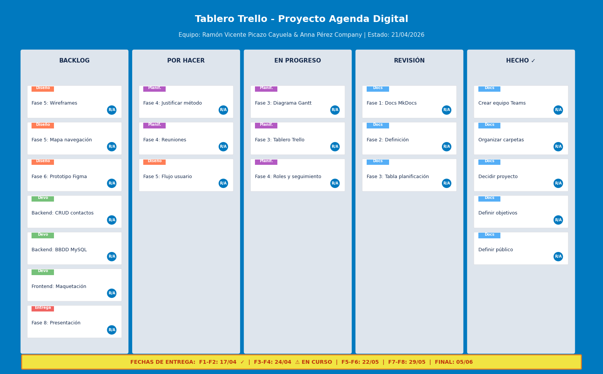
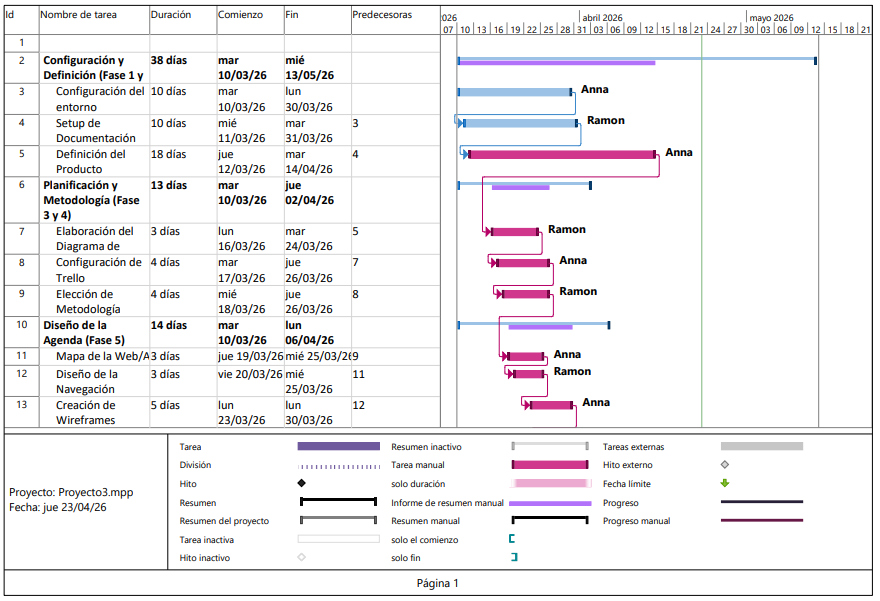

# Fase 8: Presentación Final

## 📌 Resumen de la Fase

En esta fase se prepara y realiza la presentación final del proyecto **"Agéndame Esta"**. Se resume el trabajo realizado durante todo el curso, explicando el proyecto diseñado, la organización del equipo, las herramientas empleadas, las dificultades encontradas y los aprendizajes obtenidos durante el proceso.


---

## 1. 🚀 El Proyecto Diseñado

### 1.1 ¿Qué es "Agéndame Esta"?

**"Agéndame Esta"** es una aplicación web de gestión de contactos desarrollada como proyecto final de la asignatura **Intermodular** del Ciclo Formativo de Grado Superior en **Desarrollo de Aplicaciones Multiplataforma (DAM)** del **IES L'Estació de Ontinyent**.

La aplicación permite a los usuarios:
- **Guardar** contactos personales y profesionales  
- **Organizar** la información de forma clara y estructurada  
- **Buscar y filtrar** contactos rápidamente por diferentes criterios  
- **Editar y eliminar** datos de forma sencilla  
- **Acceder** desde cualquier dispositivo con conexión a internet  

### 1.2 ¿Por qué este proyecto?

Elegimos una agenda digital porque resuelve un problema cotidiano real: la dispersión de contactos en móviles, libretas, correos y aplicaciones varias. Nuestra propuesta centraliza toda la información en una única plataforma web ligera, accesible y fácil de usar.

### 1.3 Funcionalidades Principales

| Funcionalidad | Descripción |
|---------------|-------------|
| **Listado** | Visualización completa de todos los contactos almacenados. |
| **Búsqueda** | Filtrado por nombre, apellido, teléfono, dirección o email. |
| **Añadir** | Formulario de alta de nuevos contactos con validación. |
| **Editar** | Modificación de datos tras búsqueda y selección del contacto. |
| **Eliminar** | Borrado de contactos con confirmación previa. |
| **Acerca de** | Información de la aplicación y sus creadores. |

---

## 2. 👥 Cómo nos hemos Organizado

### 2.1 Equipo

| Integrante | Rol | Responsabilidades Principales |
|-----------|-----|------------------------------|
| **Ramón Vicente Picazo Cayuela** | Desarrollador Full Stack | Backend PHP, arquitectura de base de datos, documentación MkDocs. |
| **Anna Pérez Company** | Desarrollador Full Stack | Frontend HTML/CSS/JS, prototipado visual en Canva, validaciones JavaScript. |

!!! info "Equipo de 2 personas"
    Al ser un equipo reducido, ambos asumimos tareas de desarrollo, diseño y documentación, repartiendo el trabajo según fortalezas y disponibilidad.

### 2.2 Metodología: Kanban + Scrum

Aplicamos un **modelo mixto** que combina:
- **Kanban** → Tablero Trello visual con flujo continuo de tareas (`Backlog → Por Hacer → En Progreso → Revisión → Hecho`).  
- **Scrum** → Sprints semanales de 1 semana con Planning, Daily Standup, Review y Retrospectiva.

Esta decisión se justificó porque un Scrum puro sería excesivamente burocrático para dos personas, mientras que Kanban solo podría hacer perder el foco en las entregas parciales. El híbrido nos dio flexibilidad y ritmo.

### 2.3 Calendario de Reuniones

| Día | Actividad | Duración |
|-----|-----------|----------|
| **Lunes** | Sprint Planning + Daily | 30–45 min |
| **Martes–Jueves** | Trabajo autónomo + Daily escrita en Teams | 10 min |
| **Viernes** | Sprint Review + Retrospectiva + Actualización Trello | 45 min |

### 2.4 Flujo de Trabajo

```text
BACKLOG → POR HACER → EN PROGRESO (máx. 2 tareas/persona) → REVISIÓN → HECHO ✓

Cada tarea en "Hecho" cumple tres condiciones:
- Código subido a GitHub y funcionando en local.
- Documentación asociada actualizada en MkDocs.
- Revisión y validación por el compañero (pair review).
```

---

## 3. 🛠️ Herramientas Utilizadas

### 3.1 Desarrollo

| Herramienta | Uso |
|-------------|-----|
| **PHP** | Lógica de backend y conexión a MySQL. |
| **HTML5 / CSS3 / JavaScript** | Maquetación, estilos y interactividad frontend. |
| **MySQL** | Base de datos relacional para almacenar contactos. |
| **XAMPP** | Entorno de desarrollo local (Apache + MySQL + PHP). |

### 3.2 Diseño y Prototipado

| Herramienta | Uso |
|-------------|-----|
| **Canva** | Prototipo visual de alta fidelidad (9 pantallas). |
| **Papel y boli** | Wireframes de baja fidelidad iniciales. |

### 3.3 Planificación y Gestión

| Herramienta | Uso |
|-------------|-----|
| **Trello** | Gestión ágil de tareas con etiquetas por categoría. |
| **Microsoft Project / Excel** | Diagrama de Gantt con duraciones y dependencias. |

### 3.4 Comunicación y Documentación

| Herramienta | Uso |
|-------------|-----|
| **Microsoft Teams** | Canal de comunicación, reuniones y dailies asíncronas. |
| **Git + GitHub** | Control de versiones en repositorio privado. |
| **Markdown + MkDocs** | Documentación técnica del proyecto. |
| **Material for MkDocs** | Tema visual para la documentación. |

---

## 4. ⚠️ Dificultades Encontradas

### 4.1 Técnicas

| Dificultad | Impacto | Solución Aplicada |
|-----------|---------|-------------------|
| **Conexión PHP–MySQL en local** | Media | Configuración manual de credenciales en XAMPP y pruebas iterativas. |
| **Diseño responsive** | Media | Uso de CSS Flexbox y media queries para adaptar la interfaz móvil. |
| **Validación de formularios** | Baja | Implementación de validaciones JavaScript en cliente y PHP en servidor. |
| **Gestión de rutas y navegación** | Baja | Estructura clara de carpetas en `src/` y URLs relativas consistentes. |

### 4.2 Organizativas

| Dificultad | Impacto | Solución Aplicada |
|-----------|---------|-------------------|
| **Conciliación con otras asignaturas** | Alta | Buffer de 3 días antes de cada entrega y priorización del backlog. |
| **Horarios desfasados** | Media | Comunicación asíncrona por Teams y documentación de decisiones en MkDocs. |
| **Tamaño del equipo (2 personas)** | Media | Asunción de roles flexibles y pair review obligatorio para cada tarea. |

### 4.3 De Diseño

| Dificultad | Impacto | Solución Aplicada |
|-----------|---------|-------------------|
| **Elección de la herramienta de prototipado** | Media | Descarte de Figma por curva de aprendizaje; adopción de Canva por facilidad y plan educativo. |
| **Consistencia visual entre pantallas** | Baja | Definición previa de un sistema de diseño mínimo (paleta, tipografía, sombras). |

---

## 5. 📚 Qué hemos Aprendido

### 5.1 Aprendizajes Técnicos

- **PHP y MySQL**: Reforzamos el manejo de operaciones CRUD, consultas preparadas y conexiones seguras a base de datos.  
- **HTML/CSS/JS**: Mejoramos en maquetación responsive, manejo del DOM y validación de formularios.  
- **Git avanzado**: Practicamos flujos de trabajo con ramas (`feature/`), pull requests y resolución de conflictos.  

### 5.2 Aprendizajes Metodológicos

- **Metodologías ágiles**: Comprendimos que no es necesario aplicar Scrum al 100 % para obtener sus beneficios; un modelo mixto adaptado al equipo puede ser igual de efectivo.  
- **Planificación realista**: Aprendimos a estimar duraciones de tareas y a incluir márgenes de seguridad ante imprevistos académicos.  
- **Documentación continua**: Internalizamos que documentar a medida que se avanza es mucho más eficiente que dejarlo todo para el final.  

### 5.3 Aprendizajes de Trabajo en Equipo

- **Comunicación asíncrona**: Cuando no podíamos coincidir, dejar mensajes claros en Teams con el estado de las tareas mantuvo el ritmo del proyecto.  
- **Pair review**: Revisar el código del compañero antes de integrarlo a `main` mejoró la calidad y nos obligó a entender el trabajo del otro.  
- **Gestión de expectativas**: Aprendimos a ajustar el alcance del proyecto a las fechas de entrega reales, priorizando lo esencial.  

---

## 6. 🎯 Conclusiones

- El desarrollo de **"Agéndame Esta"** nos ha permitido integrar conocimientos de múltiples módulos del ciclo DAM (programación, bases de datos, entornos de desarrollo, lenguajes de marcas) en un proyecto único y coherente.  
- La planificación previa (Gantt + Trello) y la metodología mixta fueron claves para intentar entregar el proyecto a tiempo pese a las limitaciones de un equipo de dos personas y la carga de otras asignaturas.  
- El prototipado visual en Canva, aunque no interactivo, fue suficiente para alinear las expectativas de diseño antes de escribir código, ahorrando tiempo en refactorizaciones posteriores.  
- La documentación en MkDocs no solo cumple con el requisito académico, sino que nos ha servido como herramienta de seguimiento y memoria del proyecto.  

---

## 7. 📸 Momentos del Proyecto

### 7.1 Tablero Trello Final



### 7.2 Diagrama de Gantt



### 7.3 Prototipo Visual


---

## 8. 🙏 Agradecimientos

- Al **IES L'Estació de Ontinyent** por facilitar los recursos y el entorno de aprendizaje.  
- A la **profesora de intermodular (Tamara)** por la orientación y el seguimiento del proyecto.  
- A los **compañeros del ciclo** por el intercambio de ideas y apoyo técnico puntual.  

---


!!! tip "Navegación"
    ← [Fase 7: Documentación del Proyecto](fase7.md) | ← [Inicio](index.md) → | [Fase Final: Desarroyo Aplicacion y entrega](faseFinal.md) → 