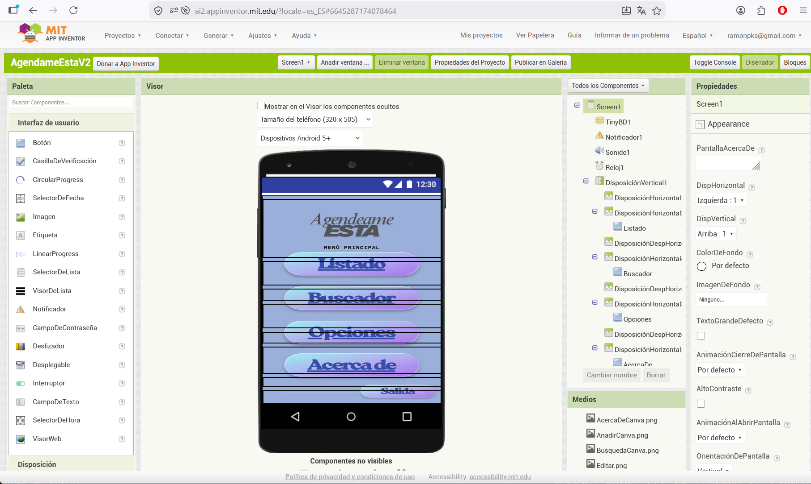

# PROYECTO INTERMODULAR DAM — ENTREGA FINAL
## "Agéndame Esta" — Aplicación Móvil de Gestión de Contactos

**Ciclo Formativo de Grado Superior en Desarrollo de Aplicaciones Multiplataforma (DAM)**  
**IES L'Estació — Ontinyent (Valencia)**  
**Curso 2025/2026**

---

**Equipo de desarrollo:**
- Ramón Vicente Picazo Cayuela — Desarrollador / Documentación
- Anna Pérez Company — Diseño / Desarrollo

**Repositorio:** `Projecto-Intermodular-Final-Dam1` (Privado — GitHub)  
**Docente:** Tamara (Intermodular)

---

## Índice

1. [Introducción](#1-introducción)
2. [Planificación](#2-planificación)
3. [Metodología de Trabajo](#3-metodología-de-trabajo)
4. [Diseño de la Aplicación](#4-diseño-de-la-aplicación)
5. [Prototipo Visual](#5-prototipo-visual)
6. [Desarrollo — MIT App Inventor 2](#6-desarrollo--mit-app-inventor-2)
7. [Evolución del Trabajo por Fases](#7-evolución-del-trabajo-por-fases)
8. [Tecnologías y Herramientas Utilizadas](#8-tecnologías-y-herramientas-utilizadas)
9. [Estructura del Repositorio](#9-estructura-del-repositorio)
10. [El Proyecto Diseñado](#10-el-proyecto-diseñado)
11. [Organización del Equipo](#11-organización-del-equipo)
12. [Dificultades Encontradas](#12-dificultades-encontradas)
13. [Aprendizajes](#13-aprendizajes)
14. [Conclusiones](#14-conclusiones)
15. [Agradecimientos](#15-agradecimientos)

---

## 1. Introducción

### 1.1 ¿Qué es "Agéndame Esta"?

**"Agéndame Esta"** es una aplicación móvil de gestión de contactos —una agenda digital— desarrollada como proyecto final de la asignatura **Intermodular** del Ciclo Formativo de Grado Superior en Desarrollo de Aplicaciones Multiplataforma del **IES L'Estació de Ontinyent**.

La aplicación permite almacenar, organizar, consultar, editar y eliminar información personal y profesional de contactos desde una interfaz móvil nativa, ademas de compartir contactos, contactar por telefono y email y accesible desde cualquier dispositivo Android.

### 1.2 Objetivos

| Objetivo | Descripción |
|----------|-------------|
| **Funcional** | Crear una agenda digital moderna con operaciones CRUD completas sobre contactos. |
| **Técnico** | Aplicar conocimientos de desarrollo móvil visual con MIT App Inventor 2 en un proyecto integrado. |
| **Metodológico** | Simular el desarrollo de un producto real con planificación, diseño y documentación profesional. |
| **Formativo** | Trabajar en equipo aplicando control de versiones, metodologías ágiles y documentación técnica. |

### 1.3 Público Objetivo

- Usuarios particulares que desean organizar sus contactos personales.
- Estudiantes que gestionan contactos académicos o profesionales.
- Pequeños negocios que necesitan una agenda simple sin sistemas complejos.

### 1.4 Problema que Resuelve

Centraliza la información de contactos que normalmente se encuentra dispersa entre móviles, libretas físicas, correos y otras aplicaciones, evitando duplicidades, pérdidas de datos y dificultades de búsqueda. La app se ejecuta directamente en el dispositivo móvil, garantizando acceso inmediato sin depender de conexión a internet.

---

## 2. Planificación

### 2.1 Calendario Académico de Entregas

| Bloque de Fases | Fecha de Apertura | Fecha de Vencimiento | Estado |
|-----------------|-------------------|----------------------|--------|
| **Fase 1 – Fase 2** | 10/03/2026 | 17/04/2026 | ✅ Entregado |
| **Fase 3 – Fase 4** | 10/03/2026 | 24/04/2026 | ✅ Entregado |
| **Fase 5 – Fase 6** | 10/03/2026 | 22/05/2026 | ✅ Entregado |
| **Fase 7 – Fase 8** | 10/03/2026 | 29/05/2026 | ✅ Entregado |
| **Entrega Final** | 10/03/2026 | **05/06/2026** | ✅ Entregado |

### 2.2 Diagrama de Gantt

El diagrama de Gantt recoge la planificación temporal completa del proyecto, incluyendo las fases de diseño, desarrollo, pruebas y documentación.


### 2.3 Tabla de Planificación Final

| Fase / Tarea | Fecha Inicio | Fecha Fin | Duración | Responsable |
|--------------|--------------|-----------|----------|-------------|
| **Fase 1: Equipo y Entorno** | 10/03/2026 | 30/03/2026 | 20 días | Ambos |
| **Fase 2: Definición del Proyecto** | 20/03/2026 | 06/04/2026 | 18 días | Ambos |
| **Fase 3: Planificación** | 10/04/2026 | 16/04/2026 | 7 días | Ambos |
| **Fase 4: Metodología** | 18/04/2026 | 23/04/2026 | 6 días | Ambos |
| **Fase 5: Diseño App** | 25/04/2026 | 08/05/2026 | 14 días | Ambos |
| **Fase 6: Prototipo Visual** | 09/05/2026 | 16/05/2026 | 8 días | Anna |
| **Desarrollo App (MIT AI2)** | 25/04/2026 | 22/05/2026 | 28 días | Ramón + Anna |
| **Pruebas y Depuración** | 16/05/2026 | 27/05/2026 | 12 días | Ambos |
| **Fase 7: Documentación Final** | 23/05/2026 | 27/05/2026 | 5 días | Ambos |
| **Fase 8: Presentación** | 26/05/2026 | 29/05/2026 | 4 días | Ambos |
| **Entrega Final y Revisión** | 30/05/2026 | 05/06/2026 | 6 días | Ambos |

### 2.4 Tablero Trello

Se utilizó Trello como herramienta de gestión visual del trabajo con estructura Kanban.

| Lista | Propósito |
|-------|-----------|
| **Backlog** | Tareas futuras pendientes de priorizar. |
| **Por Hacer** | Tareas del sprint actual no iniciadas. |
| **En Progreso** | Tareas que se están ejecutando actualmente. |
| **Revisión** | Tareas terminadas a la espera de validación. |
| **Hecho ✓** | Tareas completadas y verificadas. |


---

## 3. Metodología de Trabajo

### 3.1 Modelo Mixto: Kanban + Scrum

Dado que el equipo está formado por dos personas, se adoptó un enfoque híbrido que combina la visualización de Kanban con la planificación por iteraciones de Scrum.

| Metodología | Elementos Utilizados | Propósito |
|-------------|----------------------|-----------|
| **Kanban** | Tablero visual, flujo continuo, límites WIP. | Visualizar el estado de cada tarea y evitar cuellos de botella. |
| **Scrum** | Sprints de 1 semana, dailies, reviews, retrospectivas. | Entregar valor de forma iterativa y mantener ritmo constante. |

### 3.2 Reuniones del Equipo

| Reunión | Frecuencia | Duración | Objetivo |
|---------|------------|----------|----------|
| **Daily Standup** | De lunes a viernes | 10–15 min | Sincronizar trabajo diario y detectar bloqueos. |
| **Sprint Planning** | Lunes de cada semana | 30 min | Seleccionar tareas del backlog para el sprint. |
| **Sprint Review** | Viernes de cada semana | 20 min | Demostrar lo hecho y validar criterios de aceptación. |
| **Retrospectiva** | Viernes de cada semana | 15 min | Analizar qué funcionó, qué no, y establecer mejoras. |

### 3.3 Flujo de Trabajo en GitHub

| Convención | Descripción |
|------------|-------------|
| **Ramas** |(producción), (integración), (desarrollo). |
| **Commits** | Mensajes descriptivos en español. |
| **Pull Requests** | Cada funcionalidad nueva se integra mediante PR revisada por el compañero. |
| **Issues** | Bugs y mejoras registrados como Issues vinculados al proyecto. |


---

## 4. Diseño de la Aplicación

### 4.1 Mapa de Pantallas

La aplicación consta de **9 pantallas principales** organizadas jerárquicamente desde un menú central.

| # | Pantalla | Descripción |
|---|----------|-------------|
| 1 | **Menú Principal** | Punto de entrada con acceso a todas las secciones. |
| 2 | **Listado** | Visualización de todos los contactos almacenados. |
| 3 | **Búsqueda** | Filtrado y búsqueda de contactos por criterios. |
| 4 | **Opciones** | Submenú de gestión: Añadir, Editar, Eliminar. |
| 5 | **Añadir** | Formulario para crear un nuevo contacto. |
| 6 | **Editar** | Búsqueda del contacto a modificar. |
| 7 | **Editar Campos** | Formulario con los datos del contacto seleccionado. |
| 8 | **Eliminar** | Búsqueda y confirmación de borrado. |
| 9 | **Acerca de** | Información de los creadores y la aplicación. |


### 4.2 Estructura de Navegación

La navegación sigue un modelo **jerárquico en árbol** con retorno al menú principal. Todas las pantallas secundarias disponen de un botón **"ATRÁS"**.

- **Punto único de entrada:** Todas las funciones parten del Menú Principal.
- **Navegación bidireccional:** Cada pantalla permite avanzar y retroceder.
- **Botón ATRÁS universal:** Todas las pantallas secundarias incluyen botón de retorno.
- **Sin bucles cerrados:** No se permite la navegación circular entre pantallas del mismo nivel.
- **Salida controlada:** El botón "SALIDA" en el menú principal cierra la aplicación.


### 4.3 Wireframes de Baja Fidelidad

Los wireframes definen la disposición de elementos en cada pantalla priorizando la usabilidad.

| Pantalla | Descripción estructural |
|----------|------------------------|
| **Menú Principal** | 4 botones verticales + botón Salida. Título centrado. |
| **Listado** | Área scrollable vertical + flechas de navegación + botón Atrás. |
| **Búsqueda** | Selector desplegable + campo de texto + botón Buscar + resultados + Atrás. |
| **Opciones** | 3 botones (Añadir, Editar, Eliminar) + botón Atrás. |
| **Añadir** | 5 campos de formulario (Nombre, Apellido, Dirección, Teléfono, Email) + botones Añadir/Atrás. |
| **Editar** | Selector + campo búsqueda + botón Buscar + Atrás. |
| **Editar Campos** | 5 campos pre-rellenados + botones Editar/Atrás. |
| **Eliminar** | Selector + búsqueda + resultados seleccionables + botones Borrar/Atrás. |
| **Acerca De** | Caja informativa centrada + botón Atrás. |


---

## 5. Prototipo Visual

### 5.1 Herramienta Utilizada: Canva

Se eligió **Canva** como herramienta de prototipado visual por su facilidad de uso, acceso desde navegador, biblioteca de elementos y plan educativo gratuito.

### 5.2 Sistema de Diseño

**Paleta de colores:**

| Token | Hex | Uso |
|-------|-----|-----|
| **Fondo general** | `#8FA8C8` | Fondo de todas las pantallas |
| **Superficie / Tarjetas** | `#C084B5` | Cajas de contenido, inputs, resultados |
| **Botones principales** | Degradado `#A5F3FC` → `#C4B5FD` | Acciones principales |
| **Texto principal** | `#1E293B` | Títulos y etiquetas |
| **Borde morado** | `#7C3AED` | Bordes de cajas principales |


### 5.3 Pantallas del Prototipo de Alta Fidelidad

Todas las pantallas mantienen coherencia visual: fondo azul grisáceo, logo "Agéndame ESTA" en la parte superior, título en mayúsculas monoespaciadas, cajas con bordes redondeados asimétricos (`30px 0 30px 0`) o simétricos (`30px`), y botones tipo píldora con degradado.


---

## 6. Desarrollo — MIT App Inventor 2

### 6.1 Elección de la Plataforma

Tras valorar diferentes opciones de desarrollo, el equipo decidió implementar la aplicación como **app nativa para Android** utilizando **MIT App Inventor 2**. Esta decisión se tomó por las siguientes razones:

| Criterio | MIT App Inventor 2 | Justificación |
|----------|-------------------|---------------|
| **Curva de aprendizaje** | ✅ Muy baja | Entorno visual de bloques que permite construir apps funcionales sin escribir código textual, ideal para iteraciones rápidas en un proyecto académico. |
| **Despliegue en móvil** | ✅ Inmediato | Genera directamente un APK instalable en cualquier dispositivo Android; no requiere servidor web ni hosting. |
| **Componentes móviles nativos** | ✅ Integrados | Acceso directo a almacenamiento local, notificaciones y sensores. |
| **Base de datos local** | ✅ TinyDB | Persistencia de datos sencilla en el propio dispositivo, sin necesidad de configurar servidores MySQL ni XAMPP. |
| **Cloud opcional** | ✅ Firebase / CloudDB | Posibilidad de escalabilidad futura si se requiere sincronización entre dispositivos. |
| **Coste** | ✅ Gratuito | Plataforma web gratuita mantenida por MIT; sin licencias ni costes de despliegue. |
| **Enfoque académico** | ✅ Adecuado | Prioriza la lógica de programación, el diseño de interfaces y la experiencia de usuario sobre la configuración de infraestructura. |



### 6.2 Arquitectura de la App

La aplicación se estructura en **9 Screens (pantallas)** dentro de MIT App Inventor 2, correspondientes a las definidas en el mapa de navegación:

1. `Screen1` — Menú Principal
2. `Screen_Listado` — Listado de contactos
3. `Screen_Busqueda` — Búsqueda y filtrado
4. `Screen_Opciones` — Submenú de gestión
5. `Screen_Añadir` — Alta de contacto
6. `Screen_Editar` — Búsqueda para editar
7. `Screen_EditarCampos` — Formulario de edición
8. `Screen_Eliminar` — Búsqueda y borrado
9. `Screen_AcercaDe` — Información


### 6.3 Persistencia de Datos: TinyDB

Para el almacenamiento de contactos se utiliza **TinyDB**, una base de datos clave-valor integrada en App Inventor que guarda la información de forma persistente en el dispositivo.

- **Estructura de datos:** Cada contacto se almacena como una lista de pares clave-valor dentro de una etiqueta (`tag`) única, o como una lista de listas bajo una etiqueta global `"contactos"`.
- **Formato de contacto:** `[nombre, apellidos, direccion, telefono, email]`
- **Operaciones CRUD:**
  - **Create:** `Add Items To List` + `TinyDB.StoreValue`
  - **Read:** `TinyDB.GetValue` + iteración con `for each`
  - **Update:** Reemplazo de elemento en lista por índice + `TinyDB.StoreValue`
  - **Delete:** `Remove list item` por índice + `TinyDB.StoreValue`

  

### 6.4 Componentes Principales Utilizados

| Componente | Uso en la App |
|------------|---------------|
| **VerticalArrangement / HorizontalArrangement** | Layouts estructurales para organizar botones y campos. |
| **Button** | Navegación (Listado, Búsqueda, Opciones, Atrás, Salida) y acciones (Añadir, Buscar, Editar, Borrar). |
| **TextBox** | Entrada de datos en formularios (Nombre, Apellidos, Dirección, Teléfono, Email). |
| **ListPicker / Spinner** | Selector desplegable para elegir el campo de búsqueda (nombre, apellido, teléfono, etc.). |
| **ListView** | Visualización del listado de contactos y de resultados de búsqueda. |
| **Notificador** | Diálogos de alerta para confirmaciones ("¿Eliminar contacto?") y mensajes de error/éxito. |
| **TinyDB** | Almacenamiento local persistente de la lista de contactos. |
| **Reloj** | Gestión de timestamps opcionales para ordenación. |
| **Screen** | Gestión de la navegación entre pantallas con `open another screen`. |
| **Sonido** | Gestión para la adicción de efectos sonoros para los pulsadores, bienvenida y despedida. |
| **Compartir** | Gestión para compartir datos internos. |
| **Llamada Telefono** | Gestión de la comunicación telefonica. |

### 6.5 Lógica de Bloques Destacada

**Navegación:**  
Cada botón de menú ejecuta un bloque `open another screen screenName [NombrePantalla]`. El botón "Atrás" utiliza `close screen` para volver al nivel anterior, respetando la jerarquía definida en el diseño.

**Validación de formularios:**  
Antes de añadir o editar un contacto, se verifica que los campos obligatorios (Nombre y Teléfono) no estén vacíos mediante bloques lógicos `if ... then ... else`, mostrando un `Notifier` si falta información.

**Búsqueda:**  
Se recorre la lista de contactos almacenada en TinyDB con un bucle `for each item in list`. Se compara el valor del campo seleccionado (nombre, apellido, etc.) con el texto introducido por el usuario. Los resultados coincidentes se añaden a una lista auxiliar que se muestra en un `ListView`.

**Edición:**  
El usuario selecciona un contacto del ListView de resultados. La app guarda el índice seleccionado en una variable global, abre la pantalla de edición y precarga los campos de texto con los valores existentes mediante `set TextBox.Text`. Al confirmar, se reemplaza el elemento en la lista original y se sobrescribe en TinyDB.

**Eliminación:**  
Tras seleccionar un contacto de los resultados, un `Notifier` solicita confirmación. Si el usuario acepta, se elimina el elemento por índice y se actualiza TinyDB.

---

## 7. Evolución del Trabajo por Fases

### 7.1 Fase 1: Creación del Equipo y Entorno
Se configuró el canal de Microsoft Teams, se creó la estructura de carpetas del repositorio privado de GitHub y se inicializó la documentación en MkDocs. Ambos miembros asumieron roles de desarrollo full stack dado el tamaño reducido del equipo.

### 7.2 Fase 2: Definición del Proyecto
Se decidió desarrollar una app móvil de gestión de contactos. Se definieron los objetivos, el público objetivo, la propuesta de valor y las funcionalidades principales (CRUD de contactos, búsqueda, listado).

### 7.3 Fase 3: Planificación
Se elaboró el diagrama de Gantt ajustado al calendario académico real y se configuró el tablero Trello con etiquetas por categoría (Planificación, Diseño, Documentación, Desarrollo, Entrega). Se definieron las dependencias entre tareas y se estableció un calendario semanal tipo.

### 7.4 Fase 4: Metodología
Se justificó la elección del modelo mixto Kanban + Scrum. Se establecieron las reuniones semanales (Planning, Daily, Review, Retrospectiva) y las convenciones de trabajo en GitHub (ramas, commits, PR, issues).

### 7.5 Fase 5: Diseño de la App
Se creó el mapa de páginas/pantallas, la estructura de navegación jerárquica y los wireframes de baja fidelidad de las 9 pantallas de la aplicación. Se definieron los flujos de usuario para las operaciones principales (consultar, buscar, añadir, editar, eliminar).

### 7.6 Fase 6: Prototipo Visual
Se desarrolló el prototipo de alta fidelidad en Canva aplicando el sistema de diseño definido (paleta de colores, tipografía Inter, sombras, bordes redondeados). Se generaron las 9 pantallas finales y se documentó el flujo de navegación entre ellas.

### 7.7 Fase 7: Documentación Final
Se recopiló toda la información de las fases anteriores en los archivos Markdown de MkDocs. Se añadieron las secciones de evolución del trabajo, decisiones técnicas (incluyendo el cambio a MIT App Inventor 2) y conclusiones del proceso.

### 7.8 Fase 8: Presentación y Desarrollo Final
Se completó la implementación en MIT App Inventor 2, generando el APK funcional. Se preparó la presentación final del proyecto recogiendo el diseño, la organización, las herramientas, las dificultades y los aprendizajes del equipo.

---

## 8. Tecnologías y Herramientas Utilizadas

| Capa | Tecnología / Herramienta | Uso |
|------|------------------------|-----|
| **Desarrollo Móvil** | MIT App Inventor 2 | Entorno visual de desarrollo de apps Android (bloques + diseñador de UI). |
| **Base de Datos** | TinyDB (App Inventor) | Almacenamiento local clave-valor para persistencia de contactos en el dispositivo. |
| **Documentación** | Markdown, MkDocs, Material for MkDocs | Generación del sitio de documentación técnica. |
| **Planificación** | Trello, Diagrama de Gantt (Microsoft Project / Excel) | Gestión ágil de tareas y planificación temporal. |
| **Comunicación** | Microsoft Teams | Canal de comunicación y reuniones del equipo. |
| **Control de Versiones** | Git, GitHub | Gestión del código fuente y documentación en repositorio privado. |
| **Diseño / Prototipo** | Canva | Creación de wireframes de alta fidelidad y assets visuales. |
| **Pruebas** | Dispositivo Android físico + Emulador | Testeo de la APK generada por App Inventor. |

---

## 9. Estructura del Repositorio

```text
📁 Projecto-Intermodular-Final-Dam1/
├── 📁 docs/                    # Documentación MkDocs
│   ├── index.md
│   ├── fase1.md
│   ├── fase2.md
│   ├── ...
│   ├── fase8.md
│   └── 📁 assets/
│        ├── 📁 documentos/     # PDFs y documentos adjuntos
│        └── 📁 images/         # Imágenes, wireframes, prototipos, capturas App Inventor
├── 📁 planificacion/           # Gantt, Trello screenshots
├── 📁 diseno/                  # Wireframes adicionales, prototipo Canva
├── 📁 src/                     # Código fuente MIT App Inventor 2
│   ├── 📁 Apk
│   │    └── AgendameEstaV2.apk  # Aplicación compilada para Android
│   ├── 📁 Proyecto AppInventor 2 
│   │    └── AgendameEsta.aia    # Proyecto exportado de App Inventor
│   ├── 📁 Diseño Movil
│   │    ├── 📁 Botones/        # Graficos pantallas
│   │    └── 📁 Pantallas/      # Graficos pulsadores
│   └── 📁 Sonidos              # Sonidos para pulsadores, binevenida y despedida.
├── mkdocs.yml                  # Configuración MkDocs
├── README.md                   # Información del repositorio
└── .gitignore

```

## 10. El Proyecto Diseñado
10.1 ¿Qué es "Agéndame Esta"?

Es una aplicación móvil Android de gestión de contactos desarrollada con MIT App Inventor 2. Permite guardar contactos personales y profesionales, organizar la información de forma clara y estructurada, buscar y filtrar contactos rápidamente por diferentes criterios, editar y eliminar datos de forma sencilla, y acceder desde cualquier dispositivo Android.

10.2 ¿Por qué este proyecto?

Elegimos una agenda digital porque resuelve un problema cotidiano real: la dispersión de contactos en móviles, libretas, correos y aplicaciones varias. Nuestra propuesta centraliza toda la información en una única app móvil ligera, accesible sin conexión a internet y fácil de usar.

10.3 Funcionalidades Principales

| Funcionalidad	| Descripción |
|---------------|-------------|
|Listado |	Visualización completa de todos los contactos almacenados en TinyDB.|
|Búsqueda |	Filtrado por nombre, apellido, teléfono, dirección o email. |
|Añadir	 | Formulario de alta de nuevos contactos con validación de campos. |
|Editar	| Modificación de datos tras búsqueda y selección del contacto. |
| Eliminar |	Borrado de contactos con confirmación previa (Notifier). |
| Acerca de	| Información de la aplicación y sus creadores. |

---
## 11. Organización del Equipo

11.1 Integrantes

| Integrante	| Rol Principal | Responsabilidades |
|---------------|---------------|-------------------|
|Ramón Vicente Picazo Cayuela |	Desarrollador / Lógica	|Programación de bloques en MIT App Inventor, lógica CRUD, navegación entre screens, integración TinyDB, documentación MkDocs. |
|Anna Pérez Company	| Diseñadora / UI-UX |	Diseño de la interfaz en App Inventor (layouts, colores, tipografía), prototipado visual en Canva, validaciones de usuario, testing en dispositivo. |

    Equipo de 2 personas: Al ser un equipo reducido, ambos asumimos tareas de desarrollo, diseño y documentación, repartiendo el trabajo según fortalezas y disponibilidad.

11.2 Metodología y Flujo

Kanban: Tablero Trello con flujo continuo (Backlog → Por Hacer → En Progreso → Revisión → Hecho).

Scrum: Sprints semanales de 1 semana con Planning, Daily Standup, Review y Retrospectiva.

GitHub: Ramas main, develop y feature/. Commits descriptivos en español. Pair review obligatorio.

Definición de "Hecho": Cada tarea requiere: (1) APK funcional probado en dispositivo, (2) documentación MkDocs actualizada, (3) revisión del compañero.

---

## 12. Dificultades Encontradas

12.1 Técnicas

| Dificultad	| Impacto	| Solución Aplicada |
|---------------|-----------|-------------------|
|Gestión de listas anidadas en App Inventor	| Alta |	Uso de variables globales para mantener el índice del contacto seleccionado y estructuración de TinyDB como lista de listas. |
| Persistencia de datos entre sesiones |	Media |	Implementación de TinyDB con StoreValue / GetValue en el evento Screen.Initialize y Screen.BackPressed. |
| Navegación entre 9 pantallas	| Media |	Uso consistente de open another screen y close screen, manteniendo una pila de navegación simple sin bucles. |
| Diseño responsive en móviles	| Media	| Uso de VerticalArrangement con alturas en porcentaje y Scrollable activado en pantallas de listado. |
| Validación de formularios con bloques |	Baja	|Lógica condicional if ... then que verifica campos vacíos y formato de email básico mediante bloques de texto. |

---

12.2 Organizativas

| Dificultad	| Impacto	| Solución Aplicada |
|---------------|-----------|-------------------|
| Conciliación con otras asignaturas |	Alta	| Buffer de 3 días antes de cada entrega y priorización del backlog en Trello. |
| Horarios desfasados |	Media	| Comunicación asíncrona por Teams y documentación de decisiones en MkDocs. |
| Tamaño del equipo (2 personas) |	Media |	Asunción de roles flexibles y pair review obligatorio para cada tarea. |

---

12.3 De Diseño

| Dificultad	| Impacto	| Solución Aplicada |
|---------------|-----------|-------------------|
| Elección de la herramienta de prototipado |	Media	|Descarte de Figma por curva de aprendizaje; adopción de Canva por facilidad y plan educativo. |
| Consistencia visual entre pantallas |	Baja	|Definición previa de un sistema de diseño mínimo (paleta, tipografía, sombras) aplicado luego en App Inventor. |
| Transición de prototipo Canva a UI real |	Media	|Adaptación manual de colores hexadecimales y bordes redondeados a las propiedades de los componentes App Inventor. |

---

## 13. Aprendizajes

13.1 Técnicos

    MIT App Inventor 2: Dominio del paradigma de programación visual por bloques, comprensión del ciclo de vida de las Screens y manejo de bases de datos locales (TinyDB).
    Persistencia móvil: Aprendimos a estructurar datos en listas de listas y a garantizar que la información se mantenga entre cierres de la aplicación.
    Git avanzado: Practicamos flujos de trabajo con ramas (feature/), pull requests y resolución de conflictos en documentación Markdown.

13.2 Metodológicos

    Metodologías ágiles: Comprendimos que no es necesario aplicar Scrum al 100 % para obtener sus beneficios; un modelo mixto adaptado al equipo puede ser igual de efectivo.
    Planificación realista: Aprendimos a estimar duraciones de tareas y a incluir márgenes de seguridad ante imprevistos académicos.
    Documentación continua: Internalizamos que documentar a medida que se avanza es mucho más eficiente que dejarlo todo para el final.

13.3 De Trabajo en Equipo

    Comunicación asíncrona: Cuando no podíamos coincidir, dejar mensajes claros en Teams con el estado de las tareas mantuvo el ritmo del proyecto.
    Pair review: Revisar el trabajo del compañero antes de integrarlo a main mejoró la calidad y nos obligó a entender el trabajo del otro.
    Gestión de expectativas: Aprendimos a ajustar el alcance del proyecto a las fechas de entrega reales, priorizando lo esencial (CRUD completo + búsqueda) sobre funcionalidades secundarias.

## 14. Conclusiones

El desarrollo de "Agéndame Esta" nos ha permitido integrar conocimientos de múltiples módulos del ciclo DAM (programación, bases de datos, entornos de desarrollo, lenguajes de marcas, diseño de interfaces) en un proyecto único y coherente.

La planificación previa (Gantt + Trello) y la metodología mixta fueron claves para entregar el proyecto a tiempo pese a las limitaciones de un equipo de dos personas y la carga de otras asignaturas.

El prototipado visual en Canva, aunque no interactivo, fue suficiente para alinear las expectativas de diseño antes de construir la UI en App Inventor, ahorrando tiempo en refactorizaciones posteriores.

La elección de MIT App Inventor 2 resultó acertada para el alcance académico del proyecto: nos permitió centrarnos en la lógica de negocio, la experiencia de usuario y la entrega de un APK funcional, sin la sobrecarga de configurar servidores, bases de datos relacionales ni entornos de despliegue web.

La documentación en MkDocs no solo cumple con el requisito académico, sino que nos ha servido como herramienta de seguimiento y memoria del proyecto.

Como líneas futuras, la app podría escalarse mediante la integración de Firebase para sincronización en la nube, exportación/importación de contactos a CSV, o incluso lectura de contactos del sistema Android mediante los componentes ContactPicker de App Inventor.

## 15. Agradecimientos

Al IES L'Estació de Ontinyent por facilitar los recursos y el entorno de aprendizaje.

A la profesora de Intermodular (Tamara) por la orientación, el seguimiento del proyecto y la flexibilidad metodológica.

A los compañeros del ciclo por el intercambio de ideas y apoyo técnico puntual.


---

!!! tip "Navegación"
← [Fase 8: Presentación Final](fase8.md) | [Inicio](index.md) →